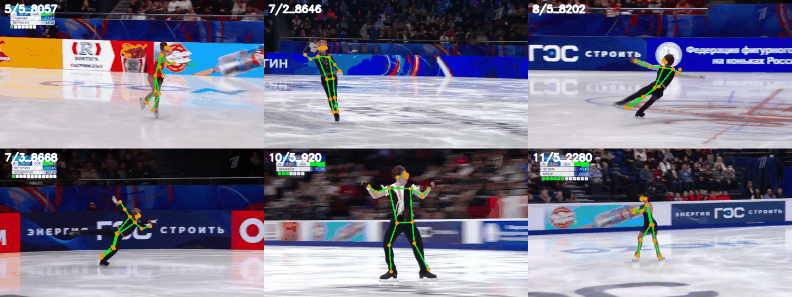

# AI Skating Assistant



Сервис анализа видео выступлений фигуристов: FastAPI backend принимает видео, ставит задачу в очередь, ML-пайплайн находит прыжки и возвращает классификацию. Статический фронт лежит в `front/` и раздается самим backend.

## Структура

- `src/backend/` — FastAPI API, очередь задач, настройки сервиса.
- `src/ml_service/` — inference-пайплайн детекции и классификации прыжков.
- `src/models/`, `src/data/`, `src/pose/`, `src/preprocessing/` — модели и вспомогательные ML-модули.
- `scripts/` — обучение, экспорт метаданных, подготовка датасета.
- `experiments/` — исследовательские и ablation-скрипты.
- `front/` — браузерный интерфейс.
- `data/` — только небольшие метаданные в git; видео, клипы, кэши и runtime-БД игнорируются.
- `checkpoints_*` — локальные веса моделей, в git не коммитятся.

## Локальный запуск

```bash
uv sync
SKATING_USE_DUMMY_PREDICTOR=true uvicorn src.backend.main:app --host 0.0.0.0 --port 9090
```

Для реального inference нужны локальные чекпойнты:

- `checkpoints_verifier/seed_*/best.pt`
- `checkpoints_pose_b3_final/seed_45/best.pt`
- `data/b3_meta.json`

## Docker

```bash
docker compose up -d --build
```

`docker-compose.yml` монтирует `data/`, `checkpoints_verifier/` и `checkpoints_pose_b3_final/` как локальные директории. Большие видео, клипы, веса и сгенерированные артефакты не должны попадать в git.
