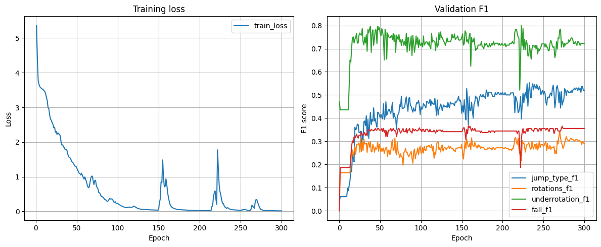
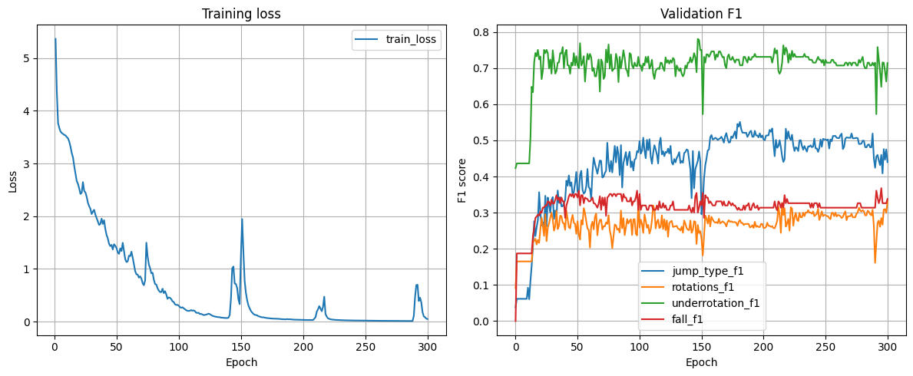
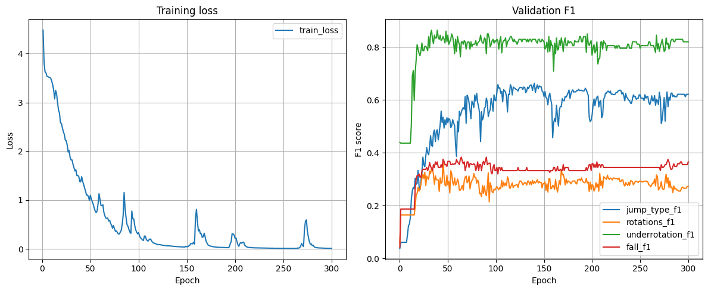
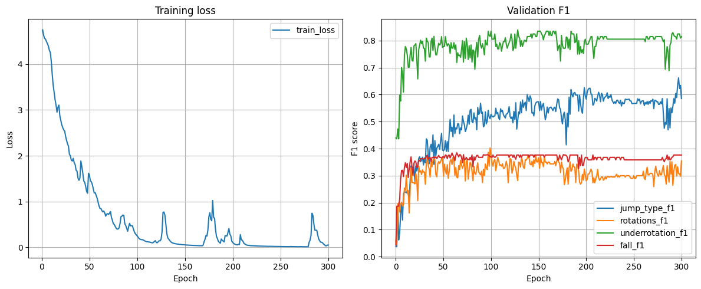
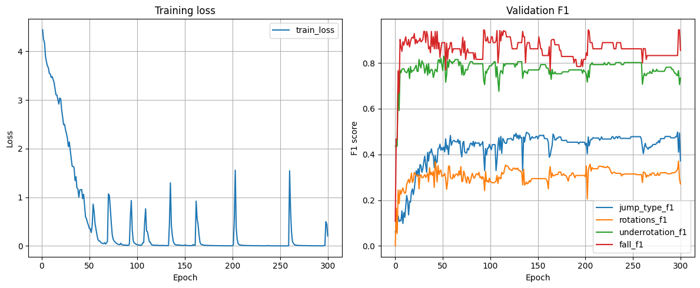
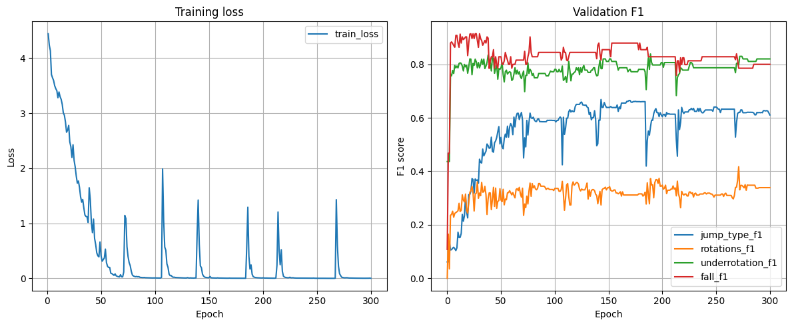
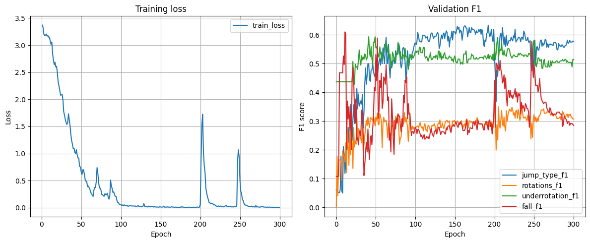
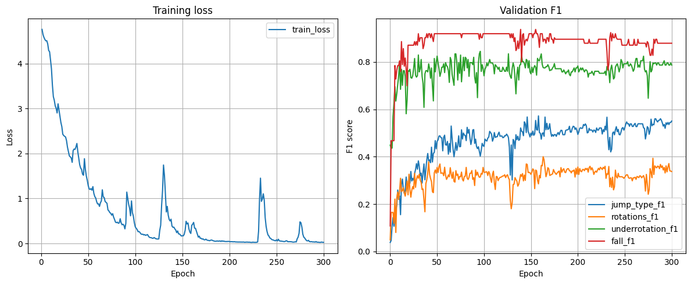
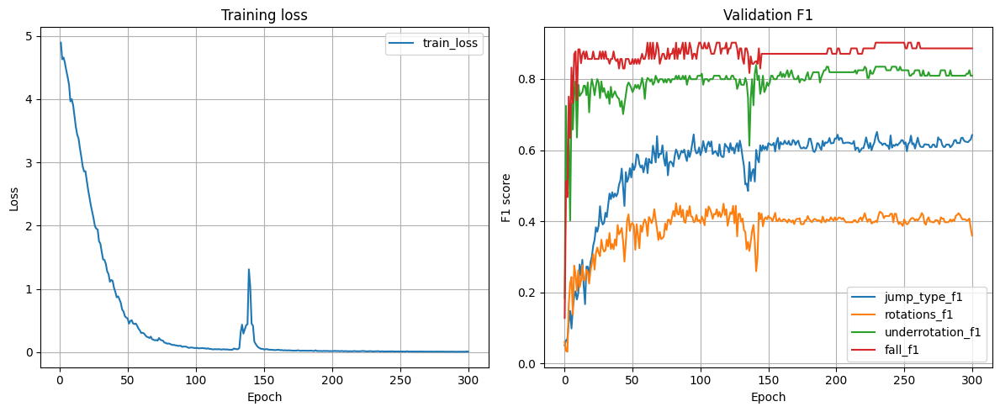

Baseline = MediaPipe (full) + LSTM + mean_pooling + 4 model heads
Epoch 300/300 | loss=0.0151 | jump_f1=0.5192 | rot_f1=0.2902 | ur_f1=0.7220 | fall_f1=0.3555

Baseline = MediaPipe (Heavy) + LSTM + mean_pooling + 4 model heads
Epoch 300/300 | loss=0.0490 | jump_f1=0.4399 | rot_f1=0.3312 | ur_f1=0.7142 | fall_f1=0.3377

Гипотеза: добавить +1 секунду к началу провалилась. Смена камеры прям перед прыжком.

Baseline = MediaPipe (full) + LSTM + mean_pooling + 4 model heads
Epoch 300/300 | loss=0.0120 | jump_f1=0.6215 | rot_f1=0.2729 | ur_f1=0.8200 | fall_f1=0.3656

Baseline = MediaPipe (full) + LSTM + mean_pooling + 4 model heads + weighted targets
Epoch 300/300 | loss=0.0481 | jump_f1=0.5855 | rot_f1=0.3545 | ur_f1=0.8149 | fall_f1=0.3766

Baseline = MediaPipe (full, IMAGE-mode) + LSTM (4 layers) + mean_pooling + 4 model heads + weighted targets
Epoch 296/300 | loss=0.0048 | jump_f1=0.4777 | rot_f1=0.3271 | ur_f1=0.7463 | fall_f1=0.8323
MediaPIpe обрабатывает картинки суммарно 1 час против 20 минут в режиме видео

Baseline = MediaPipe (full, VIDEO-mode, independent extractors) + LSTM (4 layers) + mean_pooling + 4 model heads + weighted targets
Epoch 300/300 | loss=0.0021 | jump_f1=0.6104 | jump_f1=0.3389 | ur_f1=0.8200 | fall_f1=0.7998

Baseline = MediaPipe (full, VIDEO-mode, independent extractors) + LSTM (4 layers) + mean_pooling + 4 model heads + weighted targets + 2 losses
Epoch 300/300 | loss=0.0052 | jump_f1=0.5777 | rot_f1=0.3073 | ur_f1=0.5143 | fall_f1=0.2849
Если оставить на обучение только jump_f1 и jump_f1

Baseline = MediaPipe (full, VIDEO-mode, independent extractors) + LSTM (2 layers) + mean_pooling + weighted targets + 4 losses

Baseline = MediaPipe (full, VIDEO-mode, independent extractors) + LSTM + attention_pooling + weighted targets + 4 losses
